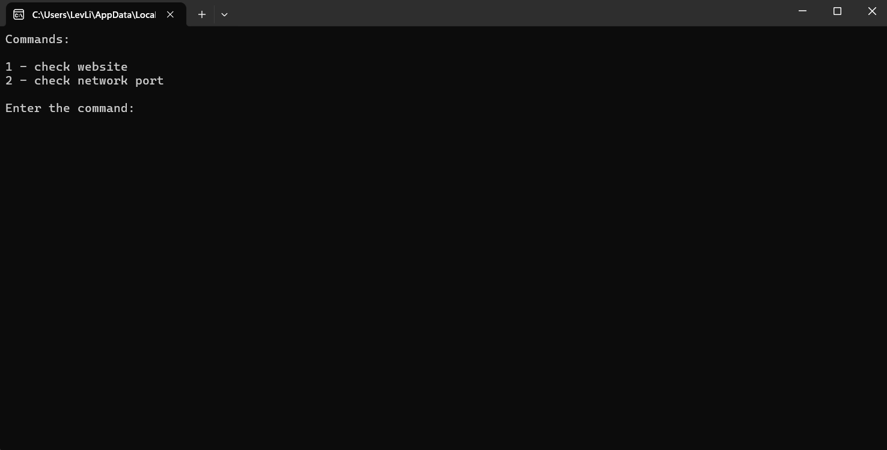
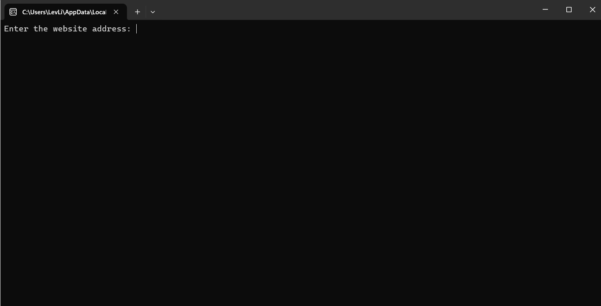
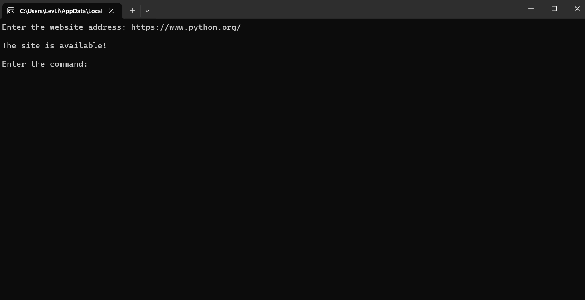
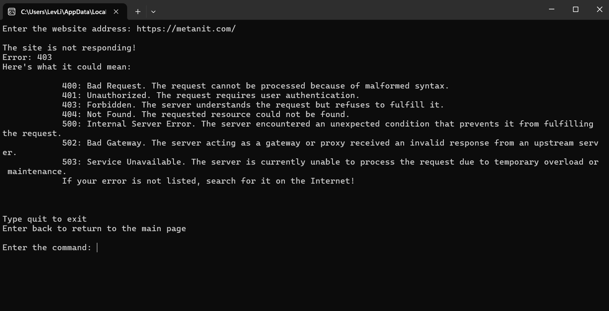

*Выберите язык:*
* [Русский (russian)]()
* [Английский (English)](/README.md)
---

# Информация
Данная утилита нужна для анализа сети, сайтов и других вещей (в будущем) в интересах **кибербезопасности**.

# Запуск и настройка
## Для работы утилиты нужен установленный Python, его можно установить с официального сайта: [https://www.python.org/](https://www.python.org/)
## Настройка
1. После установки network_cop в командной строке перейдите в папку с утилитой и введите команду:
```shell
pip install requments.txt
 ``` 
2. Прочтите файл LIST COMMANDS.txt в папке src/site_check для работы с site_cop

## Запуск
Запустите файл ```main.py``` в корневой папке утилиты.

# Инструкция
## Главная
* При запуске вам выдаст список команд, выберите нужную и введите в поле для ввода.


## site_cop
1. Сначала вам выдаст поле для ввода, введите туда адрес нужного вам сайта. 

2. Далее вам выведет сообщение о состоянии сайта, а потом поле для ввода команды (команды можно посмотреть в файле LIST COMMANDS.txt в папке src/site_check)  или 
> Если вам выдало ошибку, то вы сможете ознокомиться с ней в выведном списке

## port_cop
* С данной подутилтой у вас проблем не возникнет (надеюсь).

# ЛИЦЕНЗИЯ
## MIT ЛИЦЕНЗИЯ
```
Copyright (c) 1998, 1999, 2000 Thai Open Source Software Center Ltd
 
 Permission is hereby granted, free of charge, to any person obtaining
 a copy of this software and associated documentation files (the
 "Software"), to deal in the Software without restriction, including
 without limitation the rights to use, copy, modify, merge, publish,
 distribute, sublicense, and/or sell copies of the Software, and to
 permit persons to whom the Software is furnished to do so, subject to
 the following conditions:
 
 The above copyright notice and this permission notice shall be included
 in all copies or substantial portions of the Software.
 
 THE SOFTWARE IS PROVIDED "AS IS", WITHOUT WARRANTY OF ANY KIND,
 EXPRESS OR IMPLIED, INCLUDING BUT NOT LIMITED TO THE WARRANTIES OF
 MERCHANTABILITY, FITNESS FOR A PARTICULAR PURPOSE AND NONINFRINGEMENT.
 IN NO EVENT SHALL THE AUTHORS OR COPYRIGHT HOLDERS BE LIABLE FOR ANY
 CLAIM, DAMAGES OR OTHER LIABILITY, WHETHER IN AN ACTION OF CONTRACT,
 TORT OR OTHERWISE, ARISING FROM, OUT OF OR IN CONNECTION WITH THE
 SOFTWARE OR THE USE OR OTHER DEALINGS IN THE SOFTWARE.
```